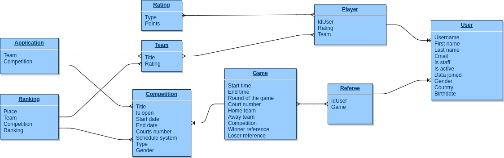

# ZpBeachVolley

This is web application which goal is to automate processes of competition.
___

## Main features have been implemented in application:

- Log in, Registration new user
- Adding role to a user (Available roles: Referee, Player)
- Send application to competition
- Creating teams (with automated calculation rating)
- Creating competitions (games are created automatically
with set tournament schedule)
- Logging games' score
- Automatically recalculation rating after ending competitions

#### Future updates:

- Extended game protocol
- Applications' payment

## Application has following schema:

## Used technologies:

- Python 3.7.5
- Django 2.2.9
- Django Rest Framework
- Postgres DB
- Celery
- RabbitMQ
- Docker
- Docker-compose
